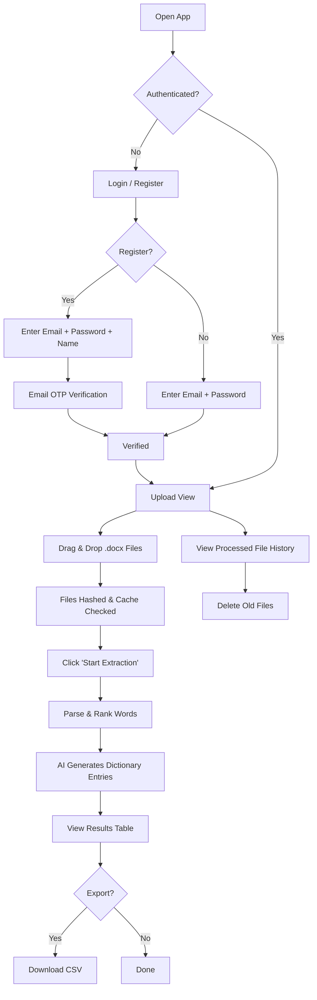
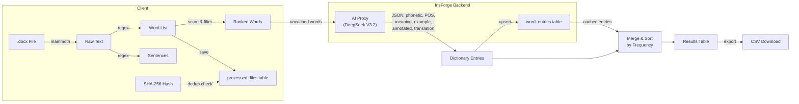
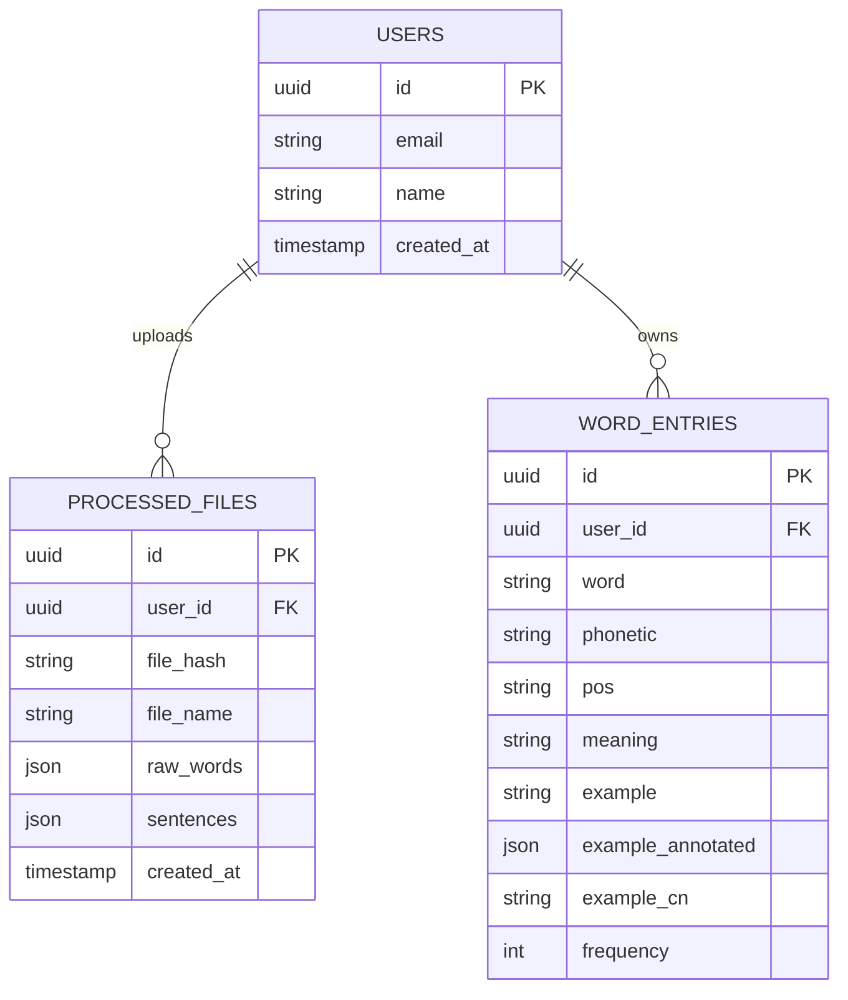

# WordWise (汇) — 智能英语词汇提取

A web app for Chinese English learners that extracts vocabulary from `.docx` documents, ranks words by difficulty, and generates AI-powered dictionary entries with phonetics, example sentences, and translations.

## Features

- Upload `.docx` files (drag & drop, up to 50 files)
- Automatic word extraction with difficulty-based ranking
- AI-generated dictionary entries: phonetics, part of speech, Chinese meaning, example sentences with per-word phonetic annotations
- Per-user caching — previously processed files and word entries are reused
- CSV export for offline study
- Email/password authentication with OTP verification

## Tech Stack

- **Frontend**: Vanilla JS + Vite (no framework)
- **Backend**: [InsForge](https://insforge.com) (auth, Postgres database, AI proxy)
- **AI Model**: DeepSeek V3.2 via InsForge AI
- **DOCX Parsing**: [Mammoth.js](https://github.com/mwilliamson/mammoth.js)
- **Hosting**: Vercel

## Getting Started

```bash
npm install
npm run dev
```

Create a `.env.local` with your InsForge credentials:

```
VITE_INSFORGE_URL=https://your-project.insforge.app
VITE_INSFORGE_ANON_KEY=your-anon-key
```

## User Flow



## Data Flow



## Backend Schema



## Project Structure

```
src/
├── main.js             # Entry point
├── app.js              # UI rendering & view routing
├── auth.js             # Authentication (InsForge auth)
├── db.js               # Database operations & file hashing
├── docx-parser.js      # .docx text extraction
├── word-ranker.js      # Word difficulty scoring & ranking
├── ai-dictionary.js    # AI-powered dictionary generation
├── insforge-client.js  # InsForge SDK client
└── style.css           # Styles (warm palette, responsive)
```

## License

Private
